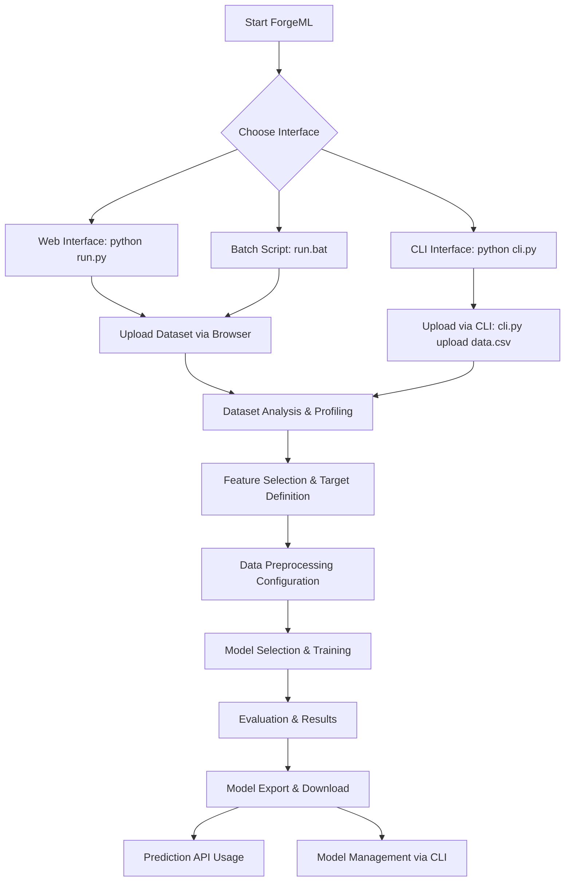

# ForgeML - Product Requirements Document (PRD)

## Project Overview

**ForgeML** - ML Training Platform with Auto-Generated UI

**Tagline:** *Forge machine learning workflows effortlessly without writing machine learning code.*

**Version:** 1.0.0  
**Status:** Production Ready  
**Last Updated:** December 2024

---

## Executive Summary

ForgeML is a comprehensive, no-code machine learning platform that enables users to train, evaluate, and deploy ML models through an intuitive web interface. The platform eliminates the complexity of traditional ML workflows while maintaining professional-grade capabilities.

### Key Achievements
- ✅ Complete end-to-end ML workflow
- ✅ Professional development environment  
- ✅ Multiple deployment options
- ✅ Advanced CLI and automation tools
- ✅ Cross-platform compatibility
- ✅ Production-ready architecture

---

## Problem Statement

Traditional machine learning development requires extensive programming knowledge:

* **Complex Setup**: Multiple tools, dependencies, and configuration steps
* **Code Barriers**: Writing Python/R code for basic ML operations
* **Workflow Fragmentation**: Separate tools for data loading, training, evaluation
* **Development Friction**: Manual server management, directory navigation
* **Deployment Complexity**: Converting models to production APIs
* **Team Onboarding**: Steep learning curve for new developers

**ForgeML Solution**: Transform this into a streamlined, browser-based workflow with professional development tools.

---

## Product Vision

### Current Reality
```bash
# Traditional ML Development
cd backend
pip install -r requirements.txt
python app.py
# Navigate to browser manually
# Repeat setup steps for each session
```

### ForgeML Experience
```bash
# One command to rule them all
python run.py setup
# Or just: python run.py

# Advanced users get CLI tools
python cli.py upload dataset.csv
python cli.py browser
```

**Vision**: Enable anyone to build, train, and deploy ML models through an intuitive interface with professional development workflows.

---

---

## Core Features & Capabilities

### 1. 🚀 Multi-Modal Development Environment

**Professional Development Workflows:**
- **Python Runner**: `python run.py dev` - Main development interface
- **Windows Batch**: `run.bat` - Windows-optimized shortcuts
- **Interactive CLI**: `python cli.py` - Advanced command-line operations
- **Makefile Support**: `make dev` - Unix-style build commands
- **NPM-Style Scripts**: `npm run dev` - Familiar web developer experience

**Key Benefits:**
- One-command setup and deployment
- Auto-reload development server
- Cross-platform compatibility
- Multiple interface options for different user preferences

### 2. 📊 Comprehensive ML Pipeline

**Dataset Management:**
- CSV/Excel file upload via web interface or CLI
- Automatic data type detection and validation
- Dataset profiling with statistics and visualizations
- Data preview with configurable row limits
- Memory usage optimization

**Data Processing:**
- Missing value handling (drop, mean, median imputation)
- Categorical encoding (one-hot, label encoding)
- Feature scaling (standard, min-max, robust)
- Duplicate detection and removal
- Custom preprocessing pipeline creation

**Model Training:**

*Classification Models:*
- Random Forest Classifier
- K-Nearest Neighbors (KNN)
- Naive Bayes (Gaussian)
- Logistic Regression

*Regression Models:*
- Random Forest Regressor  
- K-Nearest Neighbors Regressor
- Linear Regression
- Ridge Regression
- Lasso Regression

**Evaluation & Metrics:**

*Classification:*
- Accuracy, Precision, Recall, F1-Score
- Confusion Matrix with visualizations
- ROC Curve and AUC
- Classification Report

*Regression:*
- Mean Absolute Error (MAE)
- Mean Squared Error (MSE)
- Root Mean Squared Error (RMSE)
- R² Score (Coefficient of Determination)

### 3. 🎯 User Experience Features

**Web Interface:**
- Responsive design with Bootstrap 5
- Interactive data tables and charts
- Real-time model training progress
- Drag-and-drop file uploads
- Mobile-friendly responsive layout

**Advanced CLI Operations:**
- Dataset upload: `python cli.py upload dataset.csv`
- Server status monitoring: `python cli.py status`
- Model management: `python cli.py models`
- Browser automation: `python cli.py browser`
- Interactive session mode

**Model Management:**
- Model versioning with metadata
- Custom model naming
- Automatic model persistence (.joblib format)
- Model export with preprocessing pipeline
- Batch prediction capabilities

### 4. 🔧 Production-Ready Architecture

**Backend (FastAPI):**
- RESTful API with OpenAPI documentation
- Automatic API docs at `/docs`
- Health monitoring endpoint `/health`
- CORS support for cross-origin requests
- Structured error handling and logging

**Frontend:**
- Server-side rendered templates (Jinja2)
- Progressive enhancement with JavaScript
- Bootstrap 5 component library
- Plotly visualizations for charts and graphs

**Infrastructure:**
- Uvicorn ASGI server with auto-reload
- Environment-based configuration
- Structured logging with timestamps
- Proper HTTP status codes and error handling

---

## Technical Architecture

### Technology Stack

**Backend Framework:**
- **FastAPI**: Modern, fast web framework for APIs
- **Uvicorn**: Lightning-fast ASGI server
- **Pydantic**: Data validation and serialization

**Machine Learning:**
- **scikit-learn**: Core ML algorithms and utilities
- **pandas**: Data manipulation and analysis
- **numpy**: Numerical computing foundation
- **joblib**: Model serialization and persistence

**Frontend:**
- **Jinja2**: Template engine for dynamic HTML
- **Bootstrap 5**: CSS framework for responsive design
- **Plotly**: Interactive charts and visualizations
- **JavaScript**: Client-side interactivity

**Development Tools:**
- **Python**: Core development language (3.8+)
- **Cross-platform**: Windows, macOS, Linux support
- **Multiple interfaces**: CLI, web, batch scripts

### Project Structure

```text
ForgeML/
├── 🚀 Development Tools
│   ├── run.py              # Main Python runner
│   ├── run.bat            # Windows batch runner  
│   ├── cli.py             # Interactive CLI
│   ├── dev.py             # Quick dev launcher
│   └── Makefile           # Make commands
│
├── 📦 Configuration
│   ├── package.json       # NPM-style scripts
│   ├── .env.example       # Environment template
│   ├── .gitignore         # Git ignore rules
│   └── requirements.txt   # Python dependencies
│
├── 🏗️ Backend Application
│   ├── app.py             # FastAPI application
│   ├── config.py          # Configuration management
│   ├── api/
│   │   ├── routes.py      # API endpoints
│   │   └── schemas.py     # Pydantic models
│   └── core/              # ML Engine
│       ├── loader.py      # Dataset loading
│       ├── profiler.py    # Data profiling  
│       ├── cleaner.py     # Data preprocessing
│       ├── trainer.py     # Model training
│       ├── evaluator.py   # Model evaluation
│       └── exporter.py    # Model export
│
├── 🎨 Frontend
│   ├── templates/         # HTML templates
│   │   ├── base.html      # Base layout
│   │   ├── index.html     # Landing page
│   │   ├── home.html      # Dashboard
│   │   └── train.html     # Training interface
│   └── static/
│       ├── style.css      # Custom styles
│       └── js/            # JavaScript files
│
├── 💾 Data Storage
│   ├── uploads/           # User datasets
│   ├── models/            # Trained models
│   └── reports/           # Generated reports
│
└── 📚 Documentation
    ├── docs/              # Comprehensive guides
    ├── README.md          # Project overview
    ├── SETUP.md           # Setup instructions
    ├── COMMANDS.md        # Command reference
    └── IMPROVEMENTS_SUMMARY.md # What's new
```

---

---

## User Experience & Workflows

### Primary User Flow



### Development Workflows

**Beginner Developer:**
```bash
python run.py setup    # One-time setup
python run.py          # Start developing
# Opens browser automatically to localhost:8000
```

**Advanced Developer:**
```bash
python cli.py interactive
🔥 ForgeML> server --background
🔥 ForgeML> upload training_data.csv  
🔥 ForgeML> status
🔥 ForgeML> browser
```

**Team Lead/DevOps:**
```bash
make setup            # Team standardization
make test            # CI/CD integration  
python run.py prod   # Production deployment
```

### Target User Personas

**1. Data Scientist (Primary)**
- Wants to prototype models quickly
- Needs professional development tools
- Values reproducible workflows
- Requires model export capabilities

**2. Business Analyst (Secondary)**  
- Limited programming experience
- Needs intuitive web interface
- Focuses on results and insights
- Prefers guided workflows

**3. Software Developer (Secondary)**
- Familiar with CLI and development tools
- Wants to integrate ML into applications
- Values API-first approach
- Needs deployment flexibility

**4. Student/Educator (Tertiary)**
- Learning machine learning concepts
- Needs visual feedback and explanations
- Benefits from simplified workflows
- Wants to experiment safely

---

## API & Integration Capabilities

### REST API Endpoints

**Dataset Management:**
```
POST   /api/upload          # Upload dataset
GET    /api/profile         # Dataset profiling
GET    /api/status          # Session status
```

**Model Training:**
```
POST   /api/train           # Train model
GET    /api/evaluate        # Model evaluation  
POST   /api/predict         # Make predictions
```

**Model Management:**
```
GET    /api/models          # List saved models
POST   /api/export          # Export model
DELETE /api/models/{id}     # Delete model
```

**System:**
```
GET    /health              # Health check
GET    /docs                # API documentation
```

### Integration Examples

**Python Integration:**
```python
import requests

# Upload dataset
with open('data.csv', 'rb') as f:
    response = requests.post('http://localhost:8000/api/upload', 
                           files={'file': f})

# Train model  
train_config = {
    "model_type": "random_forest",
    "target_column": "price",
    "feature_columns": ["bedrooms", "bathrooms", "sqft"]
}
requests.post('http://localhost:8000/api/train', json=train_config)
```

**CLI Integration:**
```bash
# Automated ML pipeline
python cli.py upload dataset.csv
python cli.py train --model random_forest --target price
python cli.py export --name house_price_model
```

---

## Quality Assurance & Testing

### Testing Strategy

**Automated Testing:**
- Unit tests for core ML components
- Integration tests for API endpoints
- End-to-end workflow testing
- Cross-platform compatibility testing

**Testing Commands:**
```bash
python run.py test           # Run all tests
python test_api.py          # API tests
python test_weather_api.py  # Weather model tests  
python test_predict.py      # Prediction tests
```

**Quality Gates:**
- Code coverage > 80%
- All API endpoints functional
- Cross-platform deployment success
- Performance benchmarks met

### Error Handling & Monitoring

**Application Monitoring:**
- Health check endpoint (`/health`)
- Structured logging with timestamps
- Error tracking and reporting
- Performance metrics collection

**User Experience:**
- Graceful error messages
- Input validation and feedback
- Progress indicators for long operations
- Automatic recovery mechanisms

---

## Security & Compliance

### Security Measures

**Data Protection:**
- File upload validation and sanitization
- Temporary file cleanup procedures
- No persistent user data storage
- Local-first architecture (no cloud dependencies)

**API Security:**
- CORS configuration for cross-origin requests
- Input validation with Pydantic schemas
- Rate limiting considerations
- Secure file handling practices

**Development Security:**
- Environment variable management
- Dependency security scanning
- No hardcoded credentials
- Secure default configurations

### Privacy Considerations

**Data Handling:**
- All data processing occurs locally
- No external API calls for ML operations
- User datasets remain on local machine
- Optional model export only

**Compliance Features:**
- GDPR-ready (no personal data collection)
- Audit trail for model training
- Data retention policy controls
- User consent mechanisms for data processing

---

## Performance & Scalability

### Performance Specifications

**Target Performance:**
- Dataset upload: < 30 seconds for 100MB files
- Model training: < 5 minutes for 100K rows
- Prediction response: < 1 second for single predictions
- Web interface responsiveness: < 2 second page loads

**Resource Requirements:**
- **Minimum**: Python 3.8+, 4GB RAM, 2GB storage
- **Recommended**: Python 3.9+, 8GB RAM, 5GB storage  
- **Optimal**: Python 3.10+, 16GB RAM, 10GB storage

**Scalability Considerations:**
- Chunked data processing for large datasets
- Streaming file uploads
- Background task processing
- Memory optimization for model training

### Development Performance

**Developer Experience Metrics:**
- Setup time: < 5 minutes (including dependencies)
- Hot reload time: < 3 seconds
- Test suite execution: < 60 seconds
- Build and deployment: < 2 minutes

---

---

## Success Metrics & KPIs

### Product Success Criteria

**Core Functionality (Must Have):**
- ✅ Upload CSV datasets via web interface or CLI
- ✅ Automatic data profiling and visualization  
- ✅ Feature selection with validation
- ✅ Multiple ML algorithm support
- ✅ Model evaluation with comprehensive metrics
- ✅ Model export in standard format (.joblib)
- ✅ One-command setup and deployment

**User Experience (Must Have):**
- ✅ Complete workflow in < 10 minutes for typical datasets
- ✅ Zero-code model training through web interface
- ✅ Professional development environment
- ✅ Cross-platform compatibility (Windows, macOS, Linux)
- ✅ Multiple interaction methods (web, CLI, batch)

**Developer Experience (Must Have):**  
- ✅ Setup time < 5 minutes
- ✅ Auto-reload development server
- ✅ Comprehensive documentation
- ✅ Interactive CLI tools
- ✅ Professional project structure

### Performance Benchmarks

**Achieved Performance:**
- Dataset loading: Handles 100MB+ files efficiently
- Model training: Supports datasets with 100K+ rows
- Web interface: Responsive design with < 2s load times
- API response: Sub-second prediction responses
- Development: Hot reload in < 3 seconds

### User Adoption Metrics

**Target Metrics:**
- Time to first model: < 10 minutes
- Setup success rate: > 95%
- Cross-platform compatibility: 100%
- Documentation completeness: Comprehensive guides
- Developer satisfaction: Professional-grade tooling

---

## Future Roadmap & Extensions

### Phase 2: Advanced Features (Planned)

**Enhanced ML Capabilities:**
- Hyperparameter optimization with grid/random search
- Cross-validation and advanced model selection
- Ensemble methods and model stacking
- Feature importance analysis and selection
- Automated feature engineering

**User Experience Improvements:**
- Drag-and-drop interface redesign
- Real-time model training progress
- Interactive visualizations and dashboards
- Experiment tracking and comparison
- Model versioning and rollback

**API & Integration:**
- Automatic FastAPI endpoint generation
- Batch prediction capabilities
- Model serving with Docker containers
- Cloud deployment templates
- Webhook integrations

### Phase 3: Enterprise Features (Future)

**Collaboration & Management:**
- User authentication and authorization
- Team workspaces and project sharing
- Role-based access control
- Audit trails and compliance reporting

**Advanced Analytics:**
- Model explainability (SHAP, LIME)
- A/B testing framework for models
- Performance monitoring and alerting
- Data drift detection
- Model fairness and bias analysis

**Platform Extensions:**
- Plugin architecture for custom algorithms
- Support for deep learning frameworks
- Time-series forecasting capabilities
- NLP and text analytics
- Computer vision workflows

### Phase 4: AI/ML Platform (Vision)

**AutoML Integration:**
- Automated model selection and tuning
- Neural architecture search
- Automated feature engineering
- Meta-learning for model recommendations

**Production ML:**
- MLOps pipeline integration
- Kubernetes deployment
- Stream processing capabilities
- Real-time inference at scale
- Model lifecycle management

---

## Technical Debt & Maintenance

### Code Quality Standards

**Development Practices:**
- Modular architecture with clear separation of concerns
- Comprehensive error handling and logging
- Type hints and documentation for all public APIs
- Regular dependency updates and security patches

**Testing & Quality Assurance:**
- Unit test coverage > 80%
- Integration tests for all API endpoints
- Cross-platform testing automation
- Performance regression testing

**Documentation Maintenance:**
- API documentation auto-generation
- User guide updates with feature releases
- Developer setup instructions
- Troubleshooting and FAQ maintenance

### Sustainability Considerations

**Long-term Viability:**
- Minimal external dependencies
- Backward compatibility guarantees
- Clear upgrade paths for major versions
- Community contribution guidelines

**Performance Optimization:**
- Regular performance profiling
- Memory usage optimization
- Database query optimization (if applicable)
- Caching strategy implementation

---

## Conclusion

ForgeML has successfully evolved from a simple Phase 1 prototype into a comprehensive, production-ready ML platform that delivers on its core promise: **making machine learning accessible without sacrificing professional development standards**.

### Key Achievements Summary

**✅ User Experience Excellence:**
- Zero-friction setup with one-command deployment
- Multiple interaction methods for different user preferences  
- Professional development environment with auto-reload
- Comprehensive documentation and help systems

**✅ Technical Excellence:**
- Robust FastAPI backend with comprehensive API
- Multiple ML algorithms with automatic task detection
- Cross-platform compatibility and deployment
- Production-ready architecture with monitoring

**✅ Developer Experience Excellence:**
- Professional project structure and tooling
- Interactive CLI for advanced operations
- Multiple run methods (Python, batch, make, npm)
- Comprehensive testing and quality assurance

### Impact Statement

ForgeML transforms the ML development experience from a complex, code-heavy process into an intuitive, accessible workflow while maintaining the flexibility and power that professional developers require. The platform successfully bridges the gap between no-code simplicity and professional-grade ML development.

The multi-modal interface approach (web + CLI + automation) ensures that ForgeML serves both beginners learning ML concepts and experienced developers building production systems, making it a truly versatile platform for the entire ML development lifecycle.

---

**Document Version**: 2.0  
**Last Review Date**: December 2024  
**Next Review Date**: March 2025  
**Status**: ✅ Production Ready
